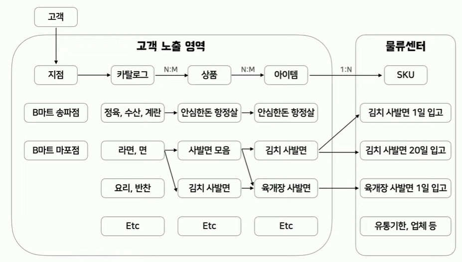

# 🔰 상품구조(USER) 시스템 구성 예시

    

 

---

 

# 🔰 Beta마트 USER 시스템 기능

- [ ] USER 정보
- [ ] USER 주소
- [ ] USER 상품주문정보
- [ ] Beta마트 상품정보
- [ ] Beta마트 매장정보

### USER 상품 확인 및 주문과정

- USER 테이블 정보 바탕으로 USER 접속
- USER 접속 시 USER주소 바탕으로 Beta마트 배정
- 해당 Beta마트 재고상품 전시
- USER 상품확인 및 선택하여 주문

 

---

 

# 🔰 필요한 것으로 예상되는 컬럼

### USER system 초기 Ideation

1. 회원 테이블(USER TABLE)
- [ ] 이름(NAME)
- [ ] ID
- [ ] PW
- [ ] email
    
2. 주소 테이블
- [ ] ID(회원 테이블)
- [ ] 주소
- [ ] 회원의 현재 선택 주소 (O,X)

3. 기본 상품 테이블 - 대분류, 중분류로 구분해서 테이블을 넓힐지 or 분류 하지않고 기본 상품테이블에 상품 다 넣고 냉동 냉장만 구분할지 고민
                    - 기본 상품 테이블에 모든 아이템 다 넣고 상품특성컬럼을 추가해서 관리 or 상품특성 테이블을 따로 추가해서 관리할지
- [ ] 상품이름
- [ ] 가격
- [ ] 상품에 대한 평점
- [ ] 상품 설명

4. 인기 상품 테이블 - 종류별 상관없이 나열
- [ ] 상품이름
- [ ] 가격
- [ ] 상품에 대한 평점
- [ ] 상품 설명

5. 특가 상품(세일) - 종류별로 특가상품 테이블 따로 만들지 안만들지 고민
- [ ] 상품이름
- [ ] 가격
- [ ] 세일률 %
- [ ] 상품에 대한 평점
- [ ] 상품 설명

6. 신상품 - 입점 2주내의 상품들 - 종류별 상관없이 나열 or (이번주 신상, 맛있는것, 편리한것)
- [ ] 상품이름
- [ ] 가격
- [ ] 신상품 세일률 %
- [ ] 상품에 대한 평점
- [ ] 상품 설명

7. 장바구니
- [ ] 상품이름(상품이 있는 테이블에 의존(FK))
- [ ] 갯수
- [ ] 선택상품가격X갯수(해당 상품 가격 X 갯수 값)
    + (테스트케이스) 장바구니의 총 가격을 구할때 선택상품가격X갯수의 총합을 구해서 표시.

# REFERENCE
https://www.youtube.com/watch?v=fg5xbs59Lro
